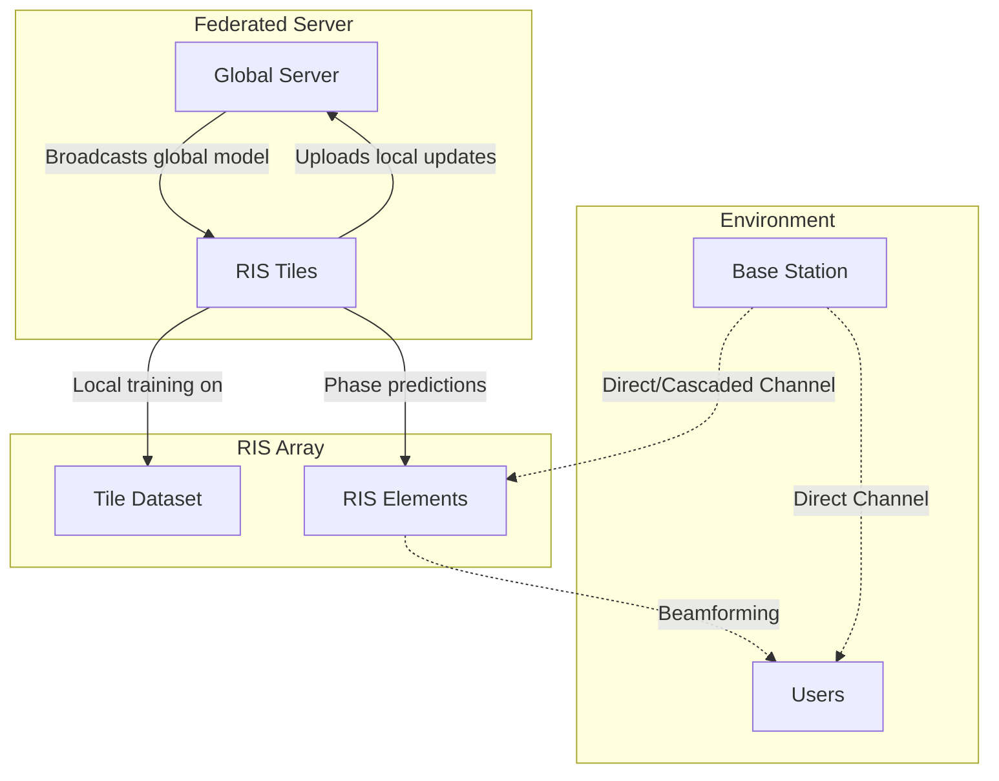

# RIS Federated Learning

Federated learning system for Reconfigurable Intelligent Surface (RIS) phase optimization. Each RIS tile trains locally on channel observations and participates in federated aggregation to predict phase shifts for mmWave beamforming while tracking communication, energy, and Network-on-Chip (NoC) costs.

## What This Repository Contains

- RIS channel generation with Rician and 3GPP UMi-style models
- Spatial correlation, CSI estimation error, phase noise, and phase quantization utilities
- Federated learning with FedAvg, FedProx, and SCAFFOLD aggregation
- Neural phase predictors: MLP, GNN/GAT, CNN with squeeze-and-excitation, and Transformer
- Baselines: random search, alternating optimization, SCA, ADMM, SDR, DRL/TD3, and centralized learning
- NoC communication simulation with multiple topologies and protocols
- Plotting, metrics, validation, and experiment scripts

## Repository Layout

```text
.
|-- main.py                         # End-to-end FL training entry point
|-- config.py                       # Central configuration
|-- experiments.py                  # Advanced experiment suite
|-- run_all_experiments.py          # Experiment runner
|-- models/
|   `-- ris_net.py                  # MLP, GNN, CNN, Transformer model factory
|-- src/
|   |-- channel_model.py            # Channel and phase hardware models
|   |-- client.py                   # RIS tile client training/evaluation
|   |-- dataset_utils.py            # Dataset generation helpers
|   |-- noc_simulator.py            # NoC topology/protocol simulator
|   `-- server.py                   # Federated aggregation server
|-- baselines/                      # Optimization and learning baselines
|-- utils/                          # Metrics, plotting, references, reports
|-- noxim_configs/                  # Noxim traffic/config files
|-- noxim_scripts/                  # Noxim helper scripts
`-- test_*.py, experiments_check.py # Smoke, component, validation checks
```

## Installation

Use Python 3.8 or newer. A virtual environment is recommended.

```bash
python3 -m venv .venv
source .venv/bin/activate
pip install -r requirements.txt
```

The default GNN implementation in `models/ris_net.py` is implemented with PyTorch only; `torch-geometric` is not required for the current code path.

## Quick Start

Run the main federated RIS training pipeline:

```bash
python main.py
```

The script will:

1. Create output directories.
2. Generate or load RIS channel datasets.
3. Evaluate simple baselines.
4. Train the federated model.
5. Save metrics, model weights, plots, and comparison tables.

Default outputs are written under `results/`, `models/saved/`, `plots/`, `metrics/`, and `data/` according to `Config` paths.

## Configuration

Most behavior is controlled in `config.py`.

Important settings include:

- `MODEL_TYPE`: one of `MLP`, `GNN`, `CNN`, `CNN_Attention`, or `Transformer`
- `NUM_TILES`, `TILE_GRID_ROWS`, `TILE_GRID_COLS`: RIS tile layout
- `ELEMENTS_PER_TILE`, `PIXEL_GRID_ROWS`, `PIXEL_GRID_COLS`: per-tile element grid
- `FL_ROUNDS`, `LOCAL_EPOCHS`, `BATCH_SIZE`, `LEARNING_RATE`: training loop parameters
- `AGGREGATION_METHOD`: `FedAvg`, `FedProx`, or `SCAFFOLD`
- `CHANNEL_MODEL_TYPE`: synthetic Rician or 3GPP UMi-style channel generation
- `PHASE_QUANTIZATION_BITS`, `PHASE_NOISE_STD_DEG`, `CSI_ERROR_VARIANCE`: hardware realism controls
- `NOC_TOPOLOGY`, `NOC_PROTOCOL`, `NOC_BANDWIDTH_GBPS`: NoC simulation controls

When changing tile or pixel geometry, keep the derived dimensions consistent. Use `Config.update_tile_config(...)` where possible.

## Running Checks

After installing dependencies, run:

```bash
python test_smoke.py
python test_components.py
python test_validation.py
python experiments_check.py
```

`test_smoke.py` performs a compact end-to-end pass. `test_components.py` checks individual building blocks. `test_validation.py` checks channel/SNR/model sanity conditions. `experiments_check.py` runs mini versions of experiment infrastructure checks.

## Experiments

Run all configured experiments:

```bash
python run_all_experiments.py
```

Run the advanced experiment suite directly:

```bash
python experiments.py
```

Experiment outputs are stored in `results/advanced_experiments` unless overridden in `Config`.

## Noxim Integration

Noxim-related traffic tables, YAML configs, helper scripts, and patch notes are kept in:

- `noxim_configs/`
- `noxim_scripts/`
- `noxim_patch/`
- `noxim_execution_guide.md`

Use these files when comparing the Python NoC simulator with hardware-accurate Noxim runs.

## Notes For Development

- `PROGRESS.md` is the active implementation tracker.
- The main priority after Phase 2 is Phase 3 code-quality and correctness work.
- The repo currently uses a class-based `Config`; several experiments mutate config values at class scope, so isolate experiment overrides carefully.
- Some scripts generate results and plots as part of normal operation.

## Architecture Diagram



## Results / Figures

The results of the experiments will be saved automatically in the `plots/` and `results/` directories.
Some typical results you will find include:
- **Convergence Curves**: Loss vs Communication Rounds
- **SNR Improvement**: SNR comparison between No RIS, Random RIS, Baseline methods, and FL RIS
- **NoC Metrics**: Latency, Bandwidth, and Energy utilization of different communication protocols

## License

This project is licensed under the MIT License - see the LICENSE file for details.

## References

Reference annotations used by plotting/report generation live in `utils/references.py`. The code comments cite the main methods used for FL aggregation, RIS optimization, GAT models, TD3, and NoC all-reduce protocols.
