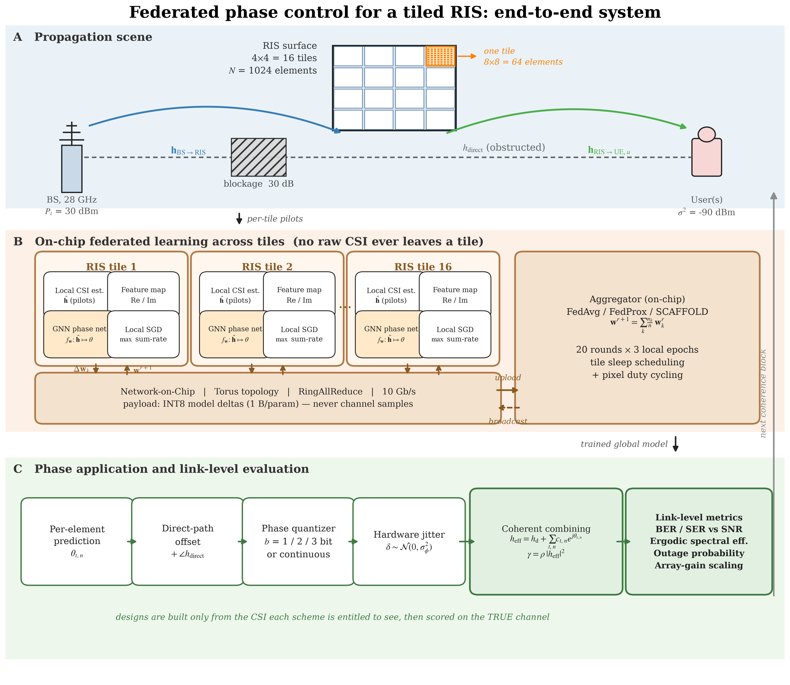

# What is new in this work

A short, checkable statement of the contributions, with the file and the
experiment that backs each one. The claims are deliberately narrow: each is
something the repository measures, not something the framing implies.

*Figure: the end-to-end system. Regenerate with `python -m utils.system_diagram`;
every parameter on it is read from `config.py`, so the picture cannot drift away
from the configuration the experiments run.*

---

## N1 — Phase control is federated **across the tiles of one surface**, not across users or base stations

Federated learning has been applied to wireless problems by treating *user
devices* or *base stations* as clients. Here the clients are the **tiles of a
single reconfigurable surface**: a 4×4 grid of tiles, each owning 8×8 = 64
phase-controllable elements, each estimating only its own slice of the cascaded
channel, and each training the same phase-prediction network on that slice.

Why this is a different problem, not a relabelling of the usual one:

- **The clients are not independent — they are summed.** Tile *t*'s phases only
  matter through the coherent sum
  `h_eff = h_direct + Σ_t Σ_n c_{t,n} e^{jθ_{t,n}}`. A per-client metric is
  therefore meaningless; the surface has to be scored as one aperture
  (`src/system_eval.py`, `experiments/link_level.py`).
- **Non-IID-ness has a physical cause.** Tiles differ because they see the same
  scene from different positions, not because a Dirichlet split was imposed on
  a shared dataset. `generate_multi_tile_channels` draws one scene per sample
  and illuminates every tile with it (`src/channel_model.py`).
- **The network is a Network-on-Chip.** Client-to-server "communication" is an
  on-die interconnect with a topology, a protocol and a power model, not an
  abstract byte count.

Where it lives: `src/channel_model.py:generate_multi_tile_channels`,
`src/dataset_utils.py:create_non_iid_datasets`, `src/server.py`,
`src/system_eval.py`.

## N2 — The training objective is the delivered link quality, not a distance to a precomputed phase target

The natural-looking supervised setup — regress onto the MRC-optimal phase vector
under an MSE loss — optimizes the wrong thing. Two phase vectors with identical
MSE can deliver very different SNR, because what matters is the *coherence* of
the summed reflected paths, not per-element angular error.

`src/objectives.py` scores the achieved weighted sum-rate directly from the
predicted phases and the true channels, differentiably and without complex
tensors, and normalizes by the genie-optimal rate for the same batch so the loss
stays O(1) (at these path losses SINR ≪ 1, so an unnormalized rate loss sits
near zero with vanishing gradients). The label also drops the global
`∠h_direct` term, which is a per-sample constant that is known from CSI at
application time and otherwise swamps the per-element structure the network has
to learn — measured label std 1.850 versus 1.814 for pure noise.

Where it lives: `src/objectives.py`, `src/channel_model.py:_channels_to_dataset`.

## N3 — The comparison is link-level and every scheme is scored on the same channel realizations

Most RIS phase-design papers report received SNR or sum-rate. This work adds the
physical-layer view — BER/SER waterfalls, outage probability, ergodic spectral
efficiency and the array-gain scaling law — and does so for **seven schemes on
one common set of channel realizations**: no-RIS, random phases, alternating
optimization, SCA, a centrally trained network, the proposed federated network,
and the perfect-CSI MRC bound.

Two methodological commitments make that comparison mean something:

- **Design from entitled CSI, score on the true channel.** Every scheme builds
  its design from the CSI it is entitled to see and is then scored against the
  true channel, so CSI error degrades a scheme through its *design* and never
  through its *scoring*.
- **One estimate, shared.** `_channels_to_dataset` records the estimate the tile
  actually saw (`H_direct_est`, `H_ris_est`, `h_bs_ris_est`), and the
  model-based solvers are driven from that same estimate. Comparing a learned
  design built on one noise draw against a convex solver built on an independent
  draw would confound estimator quality with CSI luck.

Error rates are computed semi-analytically — conditioned on the realized SNR the
link is AWGN with coherent detection, so only the average over channel
realizations is sampled. That is exact rather than an approximation of the
fading average, and `test_link_metrics.py` pins it against a Monte-Carlo run
that actually transmits Gray-mapped symbols.

Where it lives: `src/link_metrics.py`, `experiments/link_level.py`,
`utils/plotting_link.py`, `test_link_metrics.py`.

## N4 — Hardware non-idealities are in the loop, and the measured penalties are checked against theory

Discrete phase shifters, phase jitter and imperfect CSI are applied to the
*predicted* phases before the surface is scored, rather than assumed away:

- b-bit uniform quantization (`quantize_phases`), 1/2/3-bit and continuous;
- Gaussian RMS phase jitter on the commanded phase (`apply_phase_noise`);
- a **normalized** CSI estimation error ε = σ_e²/E[|h|²] (`apply_csi_error`).

The measured 1/2/3-bit array-gain losses are reported against the classical
`20·log₁₀ sinc(2⁻ᵇ)` bound, so the simulation is falsifiable rather than merely
plotted.

The normalization matters and was a real defect before this work: these cascaded
28 GHz channels have |h| ~ 1e-10, so an *absolute* error variance of 0.01 does
not degrade the estimate, it erases it. The earlier CSI-robustness sweep was a
cliff — phase error jumped straight to 91° (uniformly random) at the first
non-zero point. With ε normalized, ε = 0.001 … 1 spans 1.7° … 45° of phase
error and the robustness curve becomes readable.

Where it lives: `src/channel_model.py` (`quantize_phases`, `apply_phase_noise`,
`apply_csi_error`), `experiments/link_level.py:apply_hardware`.

## N5 — The cost side of federation is measured on a real interconnect model, not counted in abstract bytes

The federated round is charged against a Network-on-Chip with a topology
(Mesh / Torus / Folded-Torus / Tree / Butterfly / Ring), a collective protocol
(ParameterServer / AllReduce / RingAllReduce / Gossip), a bandwidth and a per-bit
energy, and the surface additionally supports tile-level sleep scheduling and
pixel-level duty cycling. The payload is INT8 model deltas — 1 byte per
parameter — and **never channel samples**.

Charging it properly is what makes the result interesting, because it
contradicts the usual federated-learning talking point. At this model size
(≈316k parameters) and this dataset size (a few hundred samples per tile), FL
moves **an order of magnitude more** bytes across the interconnect than shipping
every tile's raw CSI to a central node once would have. Table 7 reports the
ratio and the crossover: FL becomes the cheaper transfer only once the per-tile
dataset exceeds roughly `2·R·P / (4·D)` samples, where `R` is rounds, `P` is
parameters and `D` is the feature dimension.

So the honest claim is **locality, not bandwidth**: raw CSI never leaves the
tile, and inference is a single forward pass rather than an iterative solve per
coherence block — but that costs interconnect traffic at this scale rather than
saving it. That is also exactly what motivates the INT8 payload (experiment 3),
sleep scheduling and pixel duty cycling (experiment 18), and the local-epoch
sweep (experiment 1): they are the levers that move `R` and `P` in the crossover
expression.

Where it lives: `src/noc_simulator.py`, `utils/metrics.py`,
`src/client.py` (sleep scheduling, pixel duty cycling), experiments 7, 14, 15, 18.

## N6 — The whole thing is reproducible end to end, at a stated scale, with the caveats attached

Each saved result carries a `provenance` block naming the tiles, elements, FL
rounds, sample counts and whether the run was reduced. `make_summary_tables.py`
regenerates every table in these documents from the result JSON, so numbers in
the prose cannot drift from numbers on disk. The physics has a regression suite
(`test_physical_invariants.py`, `test_physics_regression.py`,
`test_link_metrics.py`) that pins the channel model, the SNR conventions and the
error-rate math.

---

## Honest limits

These belong in the paper too, and stating them is cheaper than having a
reviewer find them:

1. **With perfect CSI, closed-form MRC is optimal and the learner cannot beat
   it.** SCA converges to essentially that closed form, so under ε = 0 the
   model-based baselines sit at the bound and the learned schemes trail. The
   case for the learned design is the *cost* axis — no CSI leaving the tile, one
   forward pass instead of an iterative solve per coherence block — and the
   *robustness* axis, where the gap narrows as ε grows (Table 5).
2. **Single-antenna BS, single-user-dominant evaluation.** Cross-talk is
   configurable but zero by default; multi-user results come from a separate
   experiment and are not what the link-level figures report.
3. **Synthetic Rician / 3GPP-UMi channels.** DeepMIMO ray-tracing is supported
   but the O1_28 scenario data is not bundled, so the reported runs are
   synthetic.
4. **Scale.** The headline link-level run is stated in the provenance table
   below. Several of the 20 system experiments in
   `results/advanced_experiments/` were last run at *reduced* scale
   (`is_reduced_run: true`) to verify execution, not to produce
   publication-scale numbers.

<!-- BEGIN GENERATED TABLES -->
<!-- regenerate with: python make_summary_tables.py --write -->

## Run provenance

| Setting | Value |
|---|---|
| Tiles × elements | 16 × 64 = 1024 |
| Test scenes | 600 |
| Carrier | 28 GHz |
| Noise power | -90 dBm |
| Direct-link blockage | 30.0 dB |
| Operating point ρ | 99 dB |
| Reduced (quick) run | False |
| Seed | 42 |

## Table 1 — Link-level comparison, all schemes on one channel set

| Scheme | Array gain vs no-RIS (dB) | ρ @ BER 1e-3, QPSK (dB) | ρ @ BER 1e-4, QPSK (dB) | ρ @ BER 1e-3, 16QAM (dB) | SE @ ρ=99 dB (bit/s/Hz) | Δ vs Fed-RIS (dB) |
|---|---|---|---|---|---|---|
| No RIS (blocked direct) | 0.00 | 135.9 | 139.0 | — | 0.16 | 36.7 |
| Random phases | 0.65 | 136.9 | — | — | 0.35 | 37.7 |
| Alternating Optimization | 14.80 | 98.0 | 100.6 | 104.6 | 5.23 | -1.2 |
| SCA | 14.85 | 98.0 | 100.6 | 104.6 | 5.24 | -1.2 |
| Centralized DL (pooled) | 14.72 | 98.1 | 100.7 | 104.7 | 5.19 | -1.1 |
| **Fed-RIS (proposed)** | 12.88 | 99.2 | 101.6 | 105.8 | 4.64 | 0.0 |
| Perfect-CSI MRC (bound) | 14.91 | 97.9 | 100.5 | 104.5 | 5.26 | -1.3 |

## Table 2 — What each scheme requires to produce a phase design

| Scheme | CSI requirement | Per-block cost | CSI stays local | Inference complexity |
|---|---|---|---|---|
| No RIS (blocked direct) | — | — | yes | O(1) |
| Random phases | none | none | yes | O(N) |
| Alternating Optimization | full instantaneous | per block | no | O(N·I) |
| SCA | full instantaneous | per block | no | O(N·I) |
| Centralized DL (pooled) | pooled to server | one forward | no | O(N) |
| **Fed-RIS (proposed)** | stays on tile | one forward | yes | O(N) |
| Perfect-CSI MRC (bound) | perfect (oracle) | closed form | n/a | O(N) |

## Table 7 — Training and per-coherence-block cost

| Quantity | Value |
|---|---|
| Model parameters | 315,906 |
| FL rounds × local epochs | 20 × 3 |
| Tiles | 16 |
| Train samples per tile | 600 |
| Total NoC traffic, FL, INT8 deltas (MB) | 192.8 |
| Raw-CSI upload a centralized controller needs (MB) | 4.9 |
| FL traffic ÷ raw-CSI traffic | 39.6× |
| Samples per tile at which FL becomes the cheaper transfer | ≈ 23,752 |
| FL wall clock (s) | 3966 |
| Centralized wall clock (s) | 2522 |
| Mean per-coherence-block solve time, Alternating Optimization (ms) | 21.928 |
| Mean per-coherence-block solve time, SCA (ms) | 1.953 |
| Mean per-coherence-block inference, learned schemes | one forward pass, no iteration |

<!-- END GENERATED TABLES -->
