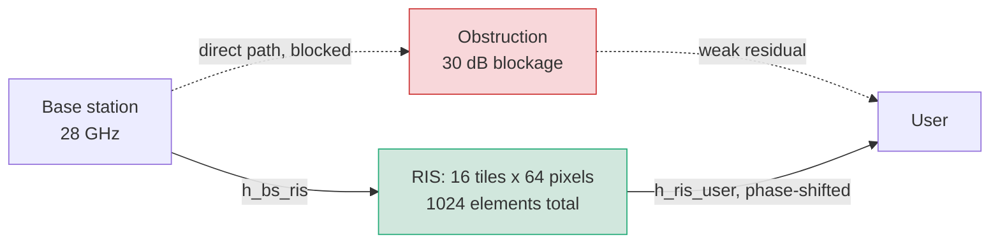
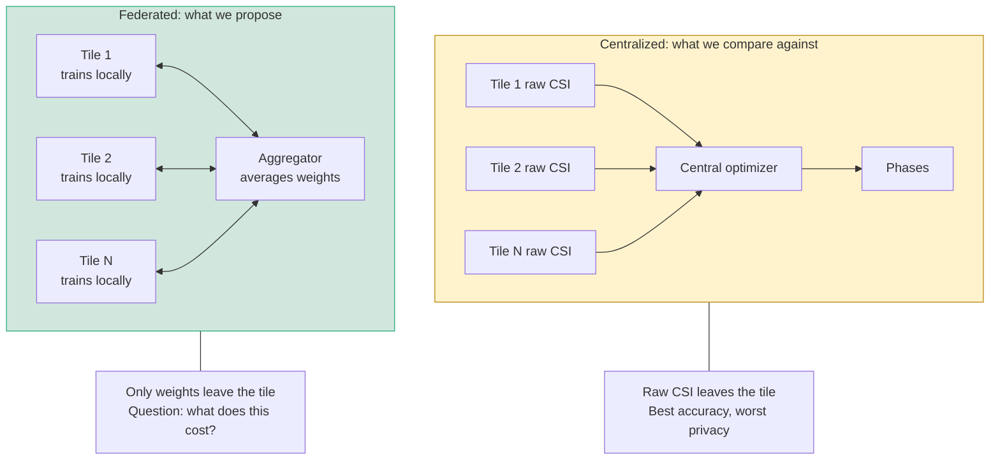
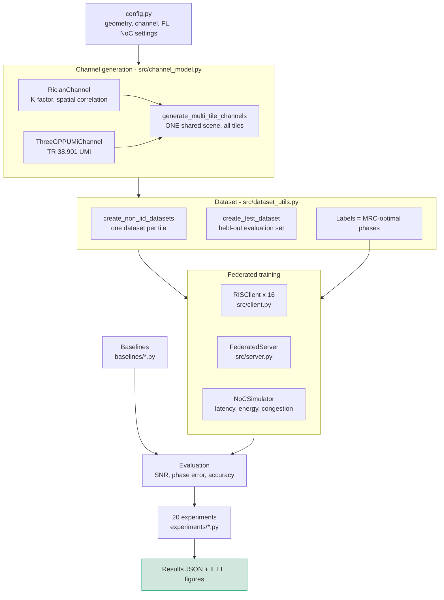
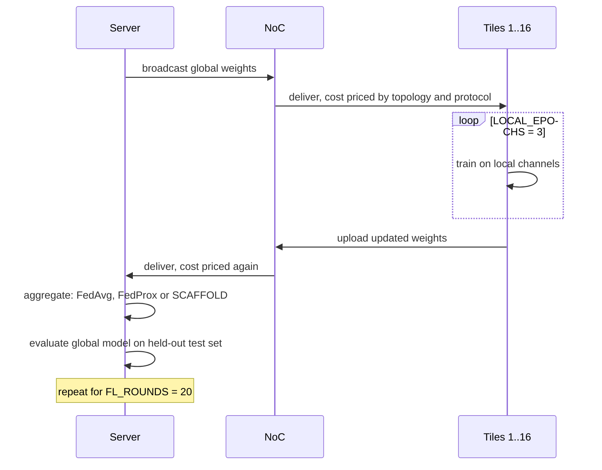
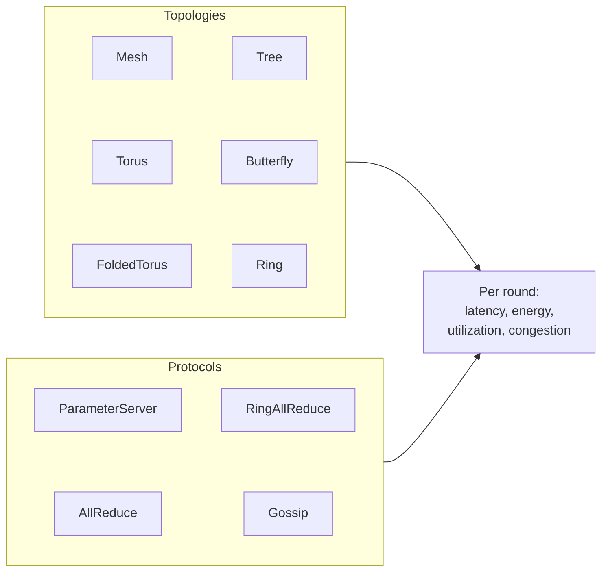
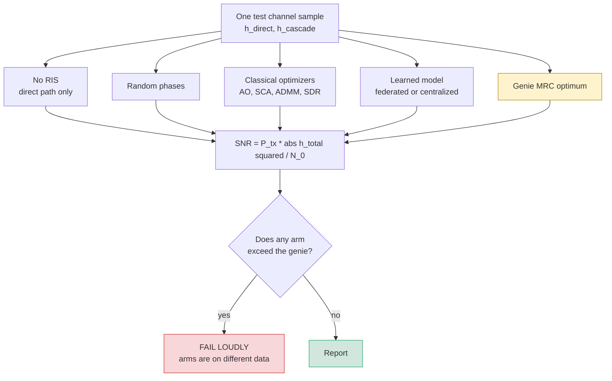
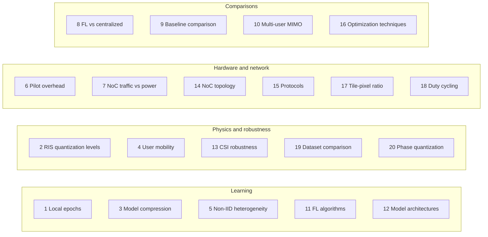
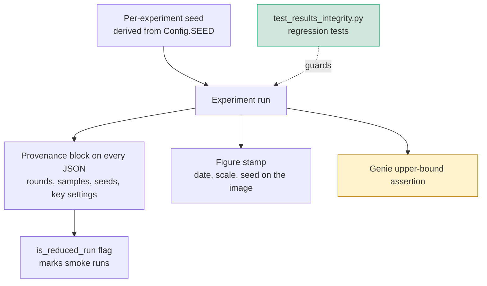

# System Flow

What this project builds, and how every piece connects.

---

## 1. The problem

A base station wants to serve a user whose direct path is blocked. A
Reconfigurable Intelligent Surface on the wall reflects the signal around the
obstruction. The surface only helps if each of its elements applies the right
phase shift, so the phases must be chosen from channel state information.

The surface here is large: **1024 elements**, arranged as **16 tiles of 64
pixels** each. Each tile carries its own small processor, and the tiles are
wired together by an on-chip network.



The received signal is the sum of the blocked direct path and the reflection:

```
h_total = h_direct + SUM_over_elements( h_cascade * exp(j * phase) )
h_cascade = h_ris_user * h_bs_ris
```

The best possible phases align every reflected contribution with the direct
path. That maximum-ratio combining solution is the **genie-aided optimum**, and
it is the upper bound nothing may exceed.

---

## 2. The central question

Conventional designs ship all channel state information to one central
optimizer. That costs bandwidth, leaks the user's channel, and scales badly.

**This project asks whether the tiles can instead learn the phase-prediction
model cooperatively, each keeping its own data, exchanging only model weights
over the on-chip network.**



Answering it honestly requires measuring the accuracy given up, the on-chip
traffic and energy spent, and the robustness gained or lost. That is what the
twenty experiments do.

---

## 3. End-to-end pipeline



**Why the scene is shared.** Every tile must be illuminated by the *same* drawn
user and the same direct path, otherwise tile 1's sample and tile 2's sample
describe different worlds and their reflections cannot be summed into one
1024-element surface.

---

## 4. One federated round



Model choices are `GNN` by default, with `MLP`, `CNN_Attention` and
`Transformer` available. The training objective is sum rate by default, with
mean-squared-error on phases and raw SNR as alternatives.

The network layer is not a formula. `NoCSimulator` routes every transfer over
the chosen topology and prices the round by its most loaded link.



---

## 5. The measurement path

Every claim reduces to comparing SNR under different phase choices. **All arms
must be scored on the same channel realisations**, or the comparison is noise.



The genie check is enforced in code, not by inspection. It exists because the
federated arm once scored *above* the oracle: the two were being evaluated on
independently drawn channels, and draw-to-draw spread is several dB, larger than
the effects being measured.

---

## 6. Experiment matrix

Twenty experiments, driven by `run_all_experiments.py`, grouped by what they
vary.



---

## 7. Integrity controls

Results that look plausible and mean nothing are the main risk in this codebase,
so several checks are wired into the pipeline itself.



| Control | Failure it prevents |
|---|---|
| Per-experiment seeding | Irreproducible runs |
| Provenance block | A 5-round smoke run passing as a full run |
| Figure stamp | A figure replotted from stale data looking fresh |
| Genie assertion | Arms compared on different channel draws |
| Measured-not-assumed rule | A closed form published as a measurement |
| Regression tests | Any of the above returning silently |

The last two exist because both happened. A fairness index was assigned as
`0.5 + 0.4 * alpha` and plotted as data, and a mobility "adaptation time" was
assigned as `5 + 2 * speed`. Neither ever touched the simulation.

---

## 8. Where things live

| Path | Role |
|---|---|
| `config.py` | Single source of truth for every parameter |
| `src/channel_model.py` | Rician and 3GPP channels, quantization, CSI error |
| `src/dataset_utils.py` | Per-tile datasets, held-out test set, partitioning |
| `src/client.py` | Tile-local training and SNR evaluation |
| `src/server.py` | FedAvg, FedProx, SCAFFOLD aggregation |
| `src/noc_simulator.py` | Topologies, protocols, latency and energy |
| `models/ris_net.py` | GNN, MLP, CNN+Attention, Transformer |
| `baselines/` | AO, SCA, ADMM, SDR, DRL, random search, centralized |
| `experiments/` | The twenty experiments |
| `utils/plotting*.py` | IEEE-style figures |
| `run_all_experiments.py` | Orchestration, seeding, progress, campaigns |
